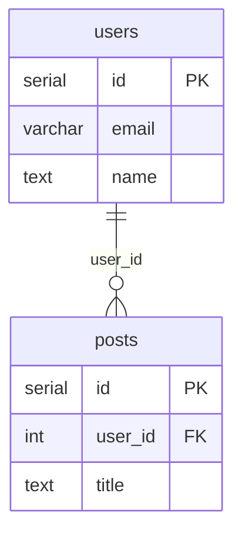

# pg2mermaid

Convert PostgreSQL dump files to Mermaid ER diagrams.

## Installation

```bash
# From the project directory
pip install -e .

# Or run directly
python -m pg2mermaid
```

## Quick Start

```bash
# Convert a pg_dump file to Mermaid
pg2mermaid schema.sql

# Save to file
pg2mermaid schema.sql -o diagram.md

# Pipe from pg_dump
pg_dump mydb --schema-only | pg2mermaid -o diagram.md
```

## Usage

```
pg2mermaid [OPTIONS] [INPUT]

Arguments:
  INPUT    Input SQL file (default: stdin)

Options:
  -o, --output FILE      Output file (default: stdout)
  --compact              Show only PK/FK columns
  --normal               Show all columns, simplified types (default)
  --full                 Show all columns with full type info
  -f, --format FORMAT    Output: mermaid, markdown, or json
  -s, --schema NAME      Include only these schemas (repeatable)
  --exclude-schema NAME  Exclude these schemas (repeatable)
  -t, --table PATTERN    Include tables matching pattern (supports *)
  -e, --exclude PATTERN  Exclude tables matching pattern (supports *)
  -c, --connected-only   Only show tables with relationships
  --max-columns N        Max columns per table (default: 20, 0=unlimited)
  -g, --group-by-schema  Group tables by schema in output
  --no-schema-prefix     Don't prefix table names with schema
  --title TEXT           Add a title to the diagram
  -v, --verbose          Show parsing statistics
  --help                 Show help message
```

## Examples

### Basic Conversion

```bash
pg2mermaid database.sql
```

Output:


### Filter by Schema

```bash
# Only include 'public' and 'auth' schemas
pg2mermaid dump.sql --schema public --schema auth
```

### Exclude Tables

```bash
# Exclude backup and staging tables
pg2mermaid dump.sql --exclude "*_backup" --exclude "*_staging" --exclude "*_old"
```

### Compact Mode (Large Schemas)

For schemas with many tables, show only primary and foreign keys:

```bash
pg2mermaid dump.sql --compact
```

### Connected Tables Only

Show only tables that have foreign key relationships:

```bash
pg2mermaid dump.sql --connected-only
```

### JSON Output

For programmatic processing:

```bash
pg2mermaid dump.sql --format json > schema.json
```

### Markdown Output

Wrap diagram in markdown code block:

```bash
pg2mermaid dump.sql --format markdown -o schema.md
```

## Viewing Diagrams

The generated Mermaid diagrams can be viewed in:

- **GitHub/GitLab**: Renders Mermaid in markdown files automatically
- **VS Code**: Install the "Mermaid Preview" extension
- **Online**: Paste into [mermaid.live](https://mermaid.live)
- **Documentation**: Works with MkDocs, Docusaurus, etc.

## Features

- **Zero dependencies**: Pure Python, no external packages required
- **Full PostgreSQL support**: Handles all standard data types
- **Smart filtering**: Include/exclude by schema, table name, or pattern
- **Scalable output**: Compact mode and column limits for large schemas
- **Relationship detection**: Parses both inline and ALTER TABLE foreign keys
- **Multiple formats**: Mermaid, Markdown-wrapped, or JSON

## Supported SQL Features

- `CREATE TABLE` with all PostgreSQL data types
- `PRIMARY KEY` (inline and table-level)
- `FOREIGN KEY` with `REFERENCES` (inline and via `ALTER TABLE`)
- `UNIQUE` constraints
- `NOT NULL` and `DEFAULT` values
- Schema-qualified table names
- Quoted identifiers

## Requirements

- Python 3.10 or higher

## License

MIT
